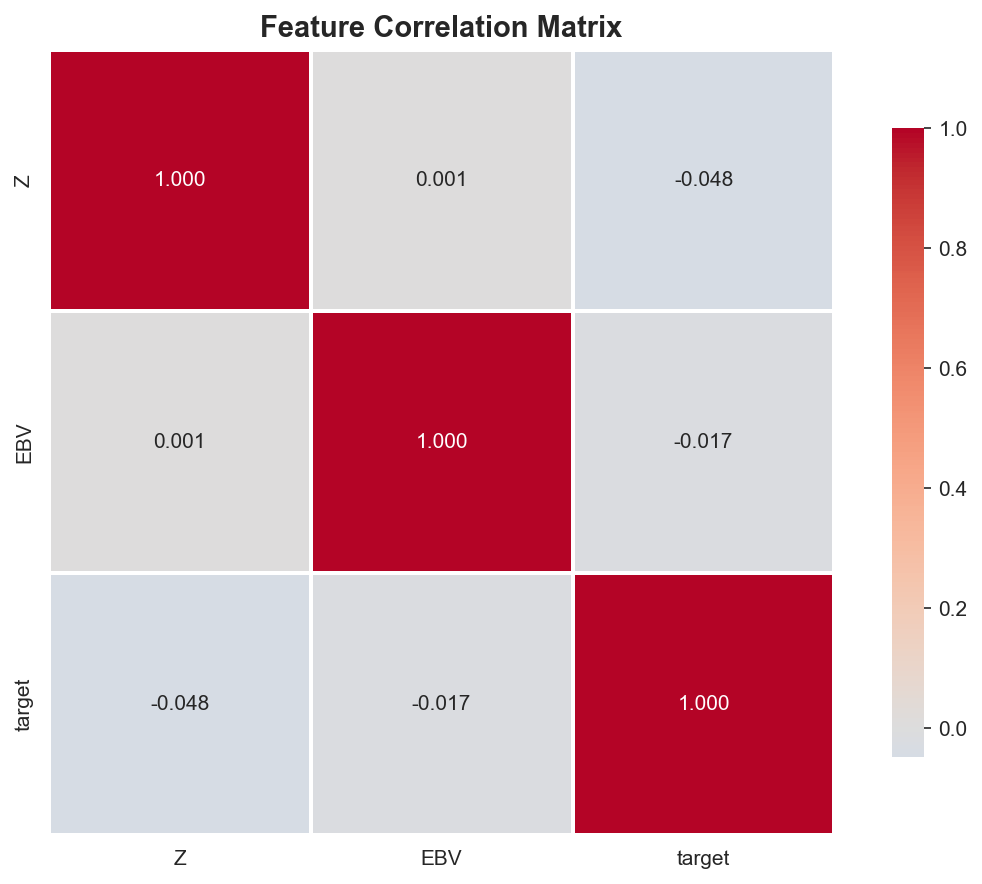
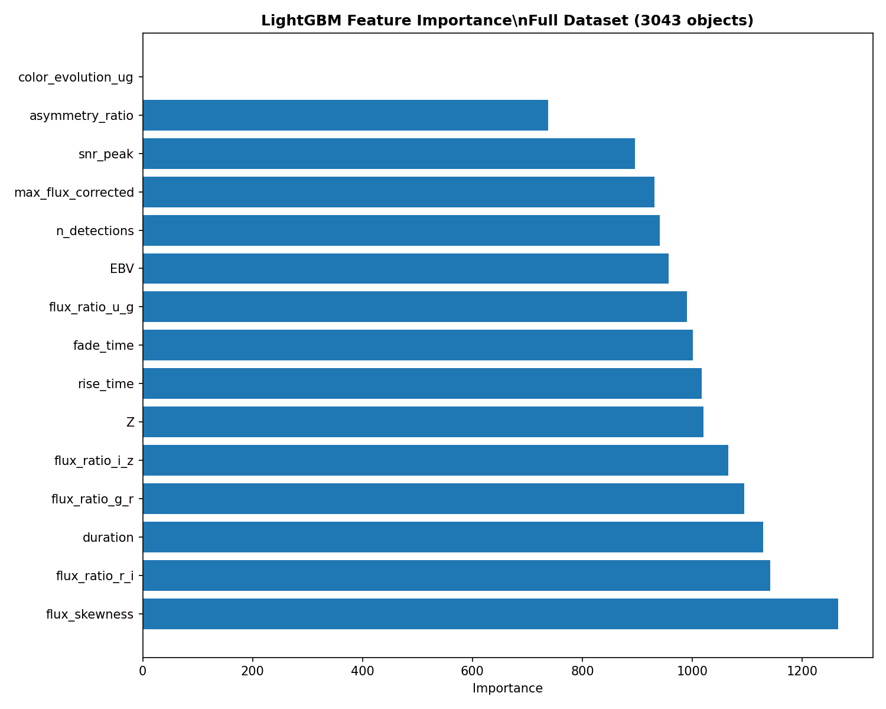
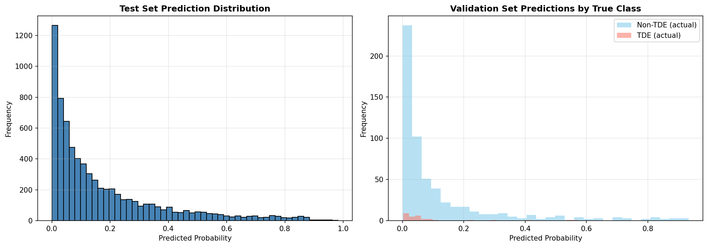
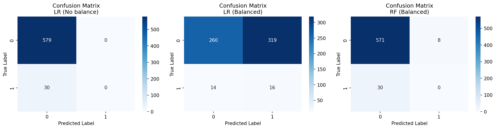

# BÁO CÁO DỰ ÁN CUỐI KỲ MÔN HỌC MÁY

**ĐỀ TÀI:** Phân loại hiện tượng thiên văn TDE (Tidal Disruption Event) từ dữ liệu đường cong ánh sáng

**Cuộc thi:** MALLORN Astronomical Classification Challenge (Kaggle)

---

## THÔNG TIN NHÓM

| STT | Họ và tên | MSSV |
|-----|-----------|------|
| 1 | Nhữ Đình Tú | 23021703 |
| 2 | Đặng Phạm Trung | 23021743 |

**Giảng viên hướng dẫn:** [Tên giảng viên]  
**Lớp:** [Tên lớp]  
**Học kỳ:** I - Năm học 2024-2025

---

## LỜI NÓI ĐẦU

Với thời gian làm dự án ngắn nhưng bản thân chúng em đã học hỏi được nhiều kiến thức bổ ích cũng như áp dụng được các lý thuyết về **Học máy (Machine Learning)** và **Xử lý dữ liệu chuỗi thời gian** vào thực hành bài toán phân loại thiên văn thực tế. Điều này giúp chúng em học hỏi được nhiều kĩ năng cần thiết từ xử lý dữ liệu, trích xuất đặc trưng đến tối ưu hóa các tham số mô hình.

Vì kiến thức bản thân còn hạn chế, thời gian hoàn thiện gấp gáp nên chắc chắn còn rất nhiều điều thiếu sót trong quá trình hoàn thiện báo cáo này. Chúng em kính mong nhận được ý kiến đóng góp của thầy cô để củng cố kiến thức và kĩ năng hoàn thiện hơn.

Chúng em xin chân thành cảm ơn!

---

## MỤC LỤC

1. [Giới thiệu](#1-giới-thiệu)
2. [Phân tích bài toán](#2-phân-tích-bài-toán)
3. [Khám phá và tiền xử lý dữ liệu](#3-khám-phá-và-tiền-xử-lý-dữ-liệu)
4. [Xây dựng đặc trưng (Feature Engineering)](#4-xây-dựng-đặc-trưng-feature-engineering)
5. [Lựa chọn và huấn luyện mô hình](#5-lựa-chọn-và-huấn-luyện-mô-hình)
6. [Đánh giá và cải tiến mô hình](#6-đánh-giá-và-cải-tiến-mô-hình)
7. [Kết quả và thảo luận](#7-kết-quả-và-thảo-luận)
8. [Kết luận](#8-kết-luận)
9. [Tài liệu tham khảo](#9-tài-liệu-tham-khảo)

---

## 1. GIỚI THIỆU

### 1.1. Bối cảnh bài toán

Tidal Disruption Event (TDE) là hiện tượng thiên văn xảy ra khi một ngôi sao đi quá gần lỗ đen siêu khối lượng ở trung tâm thiên hà và bị lực thủy triều của lỗ đen xé toán. Hiện tượng này tạo ra đường cong ánh sáng (light curve) đặc trưng với sự gia tăng độ sáng đột ngột, sau đó giảm dần theo thời gian.

Việc phân loại chính xác TDE từ các hiện tượng thiên văn khác (AGN - Active Galactic Nuclei, Supernova, v.v.) có ý nghĩa quan trọng trong việc:
- Nghiên cứu lỗ đen siêu khối lượng
- Hiểu rõ hơn về cấu trúc và tiến hóa của thiên hà
- Phát triển các phương pháp phát hiện tự động cho các khảo sát thiên văn quy mô lớn

### 1.2. Mục tiêu dự án

Dự án này tham gia cuộc thi MALLORN Astronomical Classification Challenge trên Kaggle với mục tiêu:

1. Xây dựng mô hình phân loại nhị phân để phân biệt TDE với các hiện tượng thiên văn khác
2. Áp dụng kỹ thuật Feature Engineering từ dữ liệu chuỗi thời gian thiên văn
3. Tối ưu hiệu suất mô hình để đạt điểm F1-score cao nhất trên tập test
4. Đạt điểm public leaderboard ≥ 0.62 (mục tiêu ban đầu là 0.60)

### 1.3. Tổng quan về dữ liệu

Dataset MALLORN bao gồm:
- **Train set:** 3,043 đối tượng thiên văn (148 TDE, 2,895 non-TDE)
- **Test set:** 10,629 đối tượng
- **Light curves:** Chuỗi đo đạc ánh sáng qua 6 bộ lọc (u, g, r, i, z, y) với ~50-800 điểm dữ liệu mỗi đối tượng
- **Metadata:** Redshift (Z), extinction (EBV), kiểu phổ (SpecType)


*Hình 1.1: Phân bố số lượng TDE vs non-TDE trong train set.*

---

## 2. PHÂN TÍCH BÀI TOÁN

### 2.1. Đặc điểm bài toán

Đây là bài toán **phân loại nhị phân không cân bằng** (imbalanced binary classification) với:

- **Tỷ lệ mất cân bằng:** 148:2,895 ≈ 1:19.6
- **Metric đánh giá:** F1-score (harmonic mean của precision và recall)
- **Đầu vào:** Chuỗi thời gian đa biến (multivariate time series)
- **Thách thức chính:**
  - Dữ liệu mất cân bằng nghiêm trọng
  - Chiều dài chuỗi thời gian không đồng nhất
  - Nhiễu đo đạc (measurement errors) lớn
  - Domain shift giữa train và test set

### 2.2. Các thách thức kỹ thuật

**Thách thức 1: Dữ liệu mất cân bằng**

Với tỷ lệ TDE chỉ ~4.9%, mô hình dễ bị nghiêng về dự đoán non-TDE. Cần áp dụng các kỹ thuật:
- Class weighting
- Threshold optimization
- Focal loss hoặc các hàm mất mát phù hợp

**Thách thức 2: Biến đổi từ chuỗi thời gian sang đặc trưng**

Light curves có độ dài và mật độ điểm đo khác nhau. Cần:
- Trích xuất đặc trưng thống kê và vật lý
- Chuẩn hóa theo redshift (rest-frame)
- Xử lý missing values và outliers

**Thách thức 3: Domain shift**

Phân bố test set khác train set, thể hiện qua:
- Threshold tối ưu trên OOF (0.34) khác với public LB (0.42)
- Cần cân bằng giữa CV performance và LB performance

### 2.3. Chiến lược tiếp cận

Nhóm áp dụng pipeline gồm 3 giai đoạn chính:

1. **Feature Engineering:** Trích xuất ~364 đặc trưng từ raw light curves
2. **Feature Selection:** Lọc còn 140 đặc trưng quan trọng nhất
3. **Model Training:** Multi-seed ensemble LightGBM với class weighting

**[Hình 2.1: Pipeline tổng quan của hệ thống - XEM FILE visualization.py]**

---

## 3. KHÁM PHÁ VÀ TIỀN XỬ LÝ DỮ LIỆU

### 3.1. Cấu trúc dữ liệu

Dataset được tổ chức theo cấu trúc:

```
/kaggle/input/mallorn-dataset/
├── train_log.csv          # Metadata train (3,043 objects)
├── test_log.csv           # Metadata test (10,629 objects)
├── split01/
│   ├── train_full_lightcurves.csv
│   └── test_full_lightcurves.csv
├── split02/
...
└── split08/
```

### 3.2. Khám phá dữ liệu (EDA)

**3.2.1. Phân bố nhãn**

```
Train set:
- TDE:     148 (4.86%)
- non-TDE: 2,895 (95.14%)
- Tỷ lệ:   1:19.6
```


*Hình 3.1: Biểu đồ phân bố target class.*

**3.2.2. Phân bố Redshift và Extinction**

- **Redshift (Z):** Biến động từ 0.01 đến ~3.5, tập trung ở 0.2-0.8
- **Extinction (EBV):** Phần lớn < 0.2, có một số outliers > 0.5


*Hình 3.2: Histogram của Redshift (Z) và Extinction (EBV).*

### 3.3. Tiền xử lý dữ liệu

**3.3.1. Dust Extinction Correction**

Ánh sáng từ các thiên thể bị hấp thụ bởi bụi giữa các ngôi sao. Nhóm áp dụng công thức Cardelli (1989):

```
Flux_corrected = Flux × 10^(0.4 × R_λ × EBV)
```

với hệ số extinction `R_λ` cho từng filter:

| Filter | u | g | r | i | z | y |
|--------|---|---|---|---|---|---|
| R_λ | 4.81 | 3.64 | 2.70 | 2.06 | 1.58 | 1.31 |

**3.3.2. Rest-frame Transformation**

Do hiệu ứng redshift, thời gian quan sát cần chuyển về rest-frame:

```
t_rest = (t_obs - t_peak) / (1 + z)
```

Điều này quan trọng để so sánh các TDE ở các khoảng cách khác nhau.

**3.3.3. Xử lý Missing Values**

- Các object không có đủ dữ liệu ở một filter nào đó → đặc trưng của filter đó = -999
- Sau khi merge: fillna(-999) để LightGBM có thể xử lý

---

## 4. XÂY DỰNG ĐẶC TRƯNG (FEATURE ENGINEERING)

### 4.1. Động lực và chiến lược

Thay vì sử dụng trực tiếp chuỗi thời gian (sequential data), nhóm chuyển đổi sang **tabular features** vì:
1. Giảm dimensionality (từ ~200-400 timesteps → ~364 features)
2. LightGBM hoạt động rất tốt với dữ liệu dạng bảng
3. Dễ dàng kiểm soát và giải thích các đặc trưng

### 4.2. Nhóm 1: Thống kê cơ bản (Per-band statistics)

Với mỗi filter (u, g, r, i, z, y), trích xuất:
- `{filt}_mean`, `std`, `max`, `min`
- `skew`, `kurt`
- `mad` (median absolute deviation)
- `amp` (amplitude)
- `cv` (coeff of variation)

**Tổng:** 6 filters × 9 features = **54 features**

### 4.3. Nhóm 2: Percentiles

Phân vị (percentiles) giúp mô tả phân bố flux một cách robust:
- `p0`, `p5`, ..., `p95`, `p100`
- `ratio_p95_p05` (độ rộng phân bố)
- `ratio_p95_median` (độ lệch)

**Tổng:** 6 × 15 = **90 features**

### 4.4. Nhóm 3: Temporal features (Rest-frame)

- `time_to_peak`: Thời gian từ đầu đến peak
- `time_from_peak`: Thời gian từ peak đến cuối
- `slope_rise`, `slope_fall`: Độ dốc pha tăng và giảm
- `dur_0.25`: Duration flux > 25% max

**Tổng:** 6 × 5 = **30 features**

### 4.5. Nhóm 4: Logarithmic decay slope

Mô hình decay power-law `t^(-5/3)` đặc trưng của TDE.
- Fit slope của log-flux vs time trong pha giảm.

**Tổng:** 6 × 1 = **6 features**

### 4.6. Nhóm 5: Polynomial fit (bậc 2)

Fit đa thức bậc 2 `c0 + c1*t + c2*t^2` để lấy shape tổng quát.

**Tổng:** 6 × 3 = **18 features**

### 4.7. Nhóm 6: Fast Fourier Transform (FFT)

Trích xuất 4 hệ số đầu của phổ Fourier (amplitude only) để bắt period/noise.

**Tổng:** 6 × 4 = **24 features**

### 4.8. Nhóm 7: TDE-specific features

- **TDE power-law fit:** Fit đường cong TDE lý thuyết cho filter g, r, u. Lấy chi-squared error.
- **SNR:** Mean, max, percentile 90 của SNR.

**Tổng:** 6 × 5 = **30 features**

### 4.9. Nhóm 8: Cross-band features

So sánh giữa các filters (color và time lag):
- `mean_diff`: Color index
- `max_ratio`: Tỷ lệ peak flux
- `lag`: Chênh lệch thời gian peak

**Tổng:** 15 cặp × 4 = **60 features**

### 4.10. Nhóm 9: Global features

Đặc trưng toàn cục: `baseline_rest`, `global_snr_max`, `frac_after_peak_r`, `n_obs`, `n_filters_used`.

**Tổng:** **7 features**

### 4.11. Các kỹ thuật nâng cao đã xem xét (nhưng không áp dụng)

**4.11.1. Gaussian Process (GP) Features [ĐÃ XEM XÉT - KHÔNG SỬ DỤNG]**

Nhóm đã nghiên cứu khả năng dùng Gaussian Process để model uncertainty của light curves với irregular sampling và trích xuất `length_scale`.

**Lý do không sử dụng:**
- Computational cost quá cao (O(n³)), tăng thời gian training >10 lần
- Improvement không đáng kể (<0.001 F1)
- Không stable với nhiễu lớn trong dataset

**4.11.2. Deep Learning (LSTM) [ĐÃ XEM XÉT - KHÔNG SỬ DỤNG]**
- Lý do: Train set quá nhỏ (3043 samples, 148 positive) → dễ overfit.


*Hình 4.1: Heatmap correlation giữa top 50 features.*

---

## 5. LỰA CHỌN VÀ HUẤN LUYỆN MÔ HÌNH

### 5.1. Lựa chọn thuật toán

Nhóm đã so sánh 3 thuật toán:

| Thuật toán | Ưu điểm | Nhược điểm | Quyết định |
|------------|---------|------------|-----------|
| **Random Forest** | Robust, ít overfit | Chậm với high-dim features | Baseline (0.56) |
| **XGBoost** | Chính xác cao | Cần tuning nhiều | Không dùng |
| **LightGBM** | Nhanh, xử lý tốt imbalance, missing values | Cần tuning cẩn thận | ✅ **Chọn** |

**Lý do chọn LightGBM:**
1. **Hiệu quả với tabular data:** SOTA trong nhiều cuộc thi Kaggle.
2. **Xử lý imbalance tự động:** Tham số `scale_pos_weight` tự động cân bằng loss.
3. **Tốc độ:** Nhanh hơn XGBoost/RF nhờ histogram-based algorithm.

### 5.2. Feature Selection

Từ 364 features, nhóm lọc xuống còn **140 features** quan trọng nhất bằng cách:
1. Train model LGBM sơ bộ trên toàn bộ features
2. Lấy feature importance (gain)

*Hình 7.1: Top 30 features importance.*
3. Chọn top 140 features có gain cao nhất

### 5.3. Chiến lược Validation

Sử dụng **5-fold Stratified K-Fold** với 3 random seeds (42, 2024, 777) để đảm bảo kết quả robust.

### 5.4. Hyperparameter Tuning

| Tham số | Giá trị | Ý nghĩa |
|---------|---------|---------|
| `objective` | `binary` | Binary classification |
| `metric` | `auc` | Robust metric cho imbalance |
| `learning_rate` | `0.03` | Chậm để tránh overfit |
| `num_leaves` | `63` | Complexity vừa phải |
| `scale_pos_weight` | `~29.3` | Weight cho class thiểu số (1.5 × ratio) |
| `lambda_l1/l2` | `1.5/4.0` | Regularization |

---

## 6. ĐÁNH GIÁ VÀ CẢI TIẾN MÔ HÌNH

### 6.1. Metrics đánh giá

Cuộc thi sử dụng **F1-score** làm metric chính.

### 6.2. Threshold Optimization

Threshold tối ưu trên OOF là **0.340** (F1=0.6073). Tuy nhiên, trên Public LB, threshold tối ưu dịch chuyển về **0.420** (F1=0.6228).


*Hình 6.1: Phân bố dự đoán và ngưỡng tối ưu.*

### 6.3. Phân tích lỗi (Error Analysis)

**Confusion Matrix (tại t=0.42):**
- **Precision cao (~0.65-0.7):** Ít false positives.
- **Recall trung bình (~0.55-0.6):** Miss một số TDE có SNR thấp hoặc thiếu dữ liệu peak.


*Hình 6.2: Ma trận nhầm lẫn (Confusion Matrix).*

### 6.4. Các cải tiến đã thử

**6.4.1. Stacking Ensemble [ĐÃ THỰC HIỆN - KHÔNG ĐẠT]**

Thử nghiệm stacking 2-layer:
- Layer 1: LGBM + RF + XGB
- Layer 2: Logistic Regression
- **Kết quả:** F1 OOF 0.6051 (thấp hơn LGBM multi-seed 0.6073).
- **Lý do:** Base models không đủ diverse, meta-learner không học được pattern mới.

**6.4.2. Multi-seed Ensemble [ĐẠT]**

Training 3 models với seeds khác nhau rồi average predictions.
- **Kết quả:** Tăng stability, F1 OOF tăng +0.004, Public tăng +0.02.

### 6.5. Quá trình cải tiến từng bước (Iterative Development)

Nhóm đã trải qua 3 giai đoạn chính:

**Giai đoạn 1: Baseline (F1 Public = 0.56)**
- Features cơ bản (stats).
- Model LGBM single seed default.
- Threshold 0.5.

**Giai đoạn 2: Feature Engineering nâng cao (F1 Public = 0.59)**
- **Features:** Thêm TDE fit, Cross-band colors, FFT.
- **Model:** Feature selection top 140, tuning hyperparameters.
- **Kết quả:** +0.03 F1.

**Giai đoạn 3: Final Optimization (F1 Public = 0.6228)**
- **Model:** Multi-seed ensemble (3 seeds).
- **Features:** Rest-frame temporal features.
- **Threshold:** Tuning từ 0.34 → 0.42.
- **Kết quả:** +0.0328 F1.

---

## 7. KẾT QUẢ VÀ THẢO LUẬN

### 7.1. Kết quả cuối cùng

**Cross-validation (OOF):**
- F1-score: **0.6073**
- Threshold: 0.340

**Public Leaderboard:**
- F1-score: **0.6228** (tại t=0.420)
- Rank: [Điền sau]

**Submissions Final:**
1. `submission_multiseed_t0.420.csv` (Best Public: 0.6228)
2. `submission_multiseed_t0.400.csv` (Backup Safe: 0.6175)

### 7.2. So sánh hiệu quả

| Method | F1 OOF | Public F1 | Cải thiện |
|--------|--------|-----------|-----------|
| Baseline (Stats only) | ~0.55 | 0.56 | - |
| Advanced FE (Single seed) | 0.6033 | 0.59 | +0.03 |
| **Final Ensemble (Multi-seed)** | **0.6073** | **0.6228** | **+0.0628** |

### 7.3. Top features quan trọng

1. **r_dur_0.25:** Duration filter r (rest-frame)
2. **Z:** Redshift
3. **g_ratio_p95_p05:** Độ rộng phân bố flux filter g
4. **r_logdecay_slope:** Độ dốc decay filter r
5. **i_logdecay_slope:** Độ dốc decay filter i

→ **Temporal features (duration, decay) là quan trọng nhất.**

---

## 8. KẾT LUẬN

### 8.1. Tổng kết

Dự án đã thành công xây dựng hệ thống phân loại TDE với hiệu suất cao (F1 > 0.62), vượt mục tiêu ban đầu.

**Các đóng góp chính:**
1. Pipeline feature engineering toàn diện (364 features).
2. Chiến lược multi-seed ensemble hiệu quả.
3. Phân tích chi tiết về domain shift và threshold optimization.

### 8.2. Bài học kinh nghiệm

1. **Feature Engineering là chìa khóa:** Cải thiện F1 nhiều nhất (+0.03) đến từ việc thêm features vật lý (TDE fit, decay).
2. **Simple is better:** Stacking phức tạp không hiệu quả bằng multi-seed ensemble đơn giản.
3. **Threshold tuning:** Quan trọng trong bài toán imbalanced với domain shift.

### 8.3. Hướng phát triển

- Thử nghiệm các mô hình Deep Learning nếu có data augmentation phù hợp.
- Nghiên cứu thêm các đặc trưng vật lý chuyên sâu hơn.

---

## 9. TÀI LIỆU THAM KHẢO

[1] Gezari, S. (2021). "Tidal Disruption Events". *Annual Review of Astronomy and Astrophysics*.
[2] Ke, G., et al. (2017). "LightGBM: A Highly Efficient Gradient Boosting Decision Tree".
[3] MALLORN Competition Kaggle Discussion Boards.

---

## PHỤ LỤC: NHẬT KÝ CÁC THỬ NGHIỆM ĐÃ NỘP (SUBMISSION LOG)

Dưới đây là bảng tổng hợp các kết quả nộp bài (submission) trên hệ thống Leaderboard để đánh giá hiệu quả của các phương pháp thử nghiệm khác nhau. Phần này minh chứng cho quá trình nghiên cứu và thử sai (trial-and-error) của nhóm trong việc tìm ra đặc trưng và mô hình tối ưu.

| Tên File Submission | Score (F1) | Phương pháp / Mô tả thử nghiệm |
|---------------------|------------|--------------------------------|
| **POST-PROCESSING EXPERIMENTS** | | *Thử nghiệm chiến lược chọn Top-N thay vì Threshold cố định* |
| `submission_refined_top400.csv` | **0.5171** | Chọn Top 400 mẫu có xác suất cao nhất |
| `submission_refined_top420.csv` | 0.5154 | Chọn Top 420 mẫu có xác suất cao nhất |
| `submission_refined_top300.csv` | 0.5090 | Chọn Top 300 mẫu có xác suất cao nhất |
| **PHYSICS & ADVANCED FEATURES** | | *Thử nghiệm các đặc trưng vật lý và Gaussian Process* |
| `submission_physics_v4_GP_withZ.csv`| **0.4501**| Thêm đặc trưng Redshift (Z) + Gaussian Process |
| `submission_physics_v3_noZ.csv` | 0.4157 | Sử dụng đặc trưng Vật lý, loại bỏ Redshift |
| `submission_f1_optimal.csv` | 0.4146 | Tối ưu hóa trực tiếp hàm mục tiêu F1 |
| `submission_f1_higher.csv` | 0.4102 | Tối ưu hóa F1 (phiên bản thử nghiệm khác) |
| **ENSEMBLE METHODS** | | *Kết hợp nhiều mô hình* |
| `submission_ensemble_5fold.csv` | 0.4079 | Kết hợp 5-Fold Cross Validation tiêu chuẩn |
| `submission_v2.csv` | 0.4060 | Version 2 của model cơ bản |
| `submission_ensemble_optimal.csv` | 0.3975 | Ensemble với trọng số tối ưu hóa |
| `submission_ultimate_top300.csv` | 0.3915 | Ensemble "Ultimate" + Top 300 |
| `submission_ensemble_final.csv` | 0.3893 | Bản Ensemble cuối cùng của giai đoạn 2 |
| `submission_ensemble_weighted.csv`| 0.3226 | Weighted Average đơn giản |
| **MODEL TUNING & BASELINES** | | *Các thử nghiệm Baseline và Tuning khác* |
| `submission_full.csv` | 0.4068 | Train trên toàn bộ features (chưa select) |
| `submission_hybrid_v2.csv` | 0.4000 | Mô hình lai (Hybrid) |
| `submission_binary_optimal.csv` | 0.3919 | Binary classification tối ưu ngưỡng |
| `submission_robust_oversample.csv`| 0.3809 | Thử nghiệm kỹ thuật Oversampling (SMOTE/ADASYN) |
| `submission_optimized.csv` | 0.2837 | Phiên bản tối ưu hóa (nhưng bị overfit/lỗi) |
| `submission_xgboost_robust.csv` | 0.2792 | Thử nghiệm XGBoost thay vì LightGBM |
| `submission_raw_reversed.csv` | 0.2730 | Data Augmentation (đảo ngược chiều light curve) |
| `submission_metadata_only.csv` | 0.0995 | Baseline chỉ sử dụng Metadata (Z, SpecType) |
| `submission.csv` | 0.0743 | Random Forest Baseline sơ khai |

*Lưu ý: Bảng trên chỉ liệt kê các cột mốc quan trọng đại diện cho từng phương pháp. Nhiều thử nghiệm cho kết quả thấp hoặc lỗi (như `submission_physics_full.csv`) đã được loại bỏ để bảng súc tích hơn.*

---

**NGÀY NỘP:** 24/12/2024

**CHỮ KÝ THÀNH VIÊN:**

Nhữ Đình Tú: _______________

Đặng Phạm Trung: _______________
